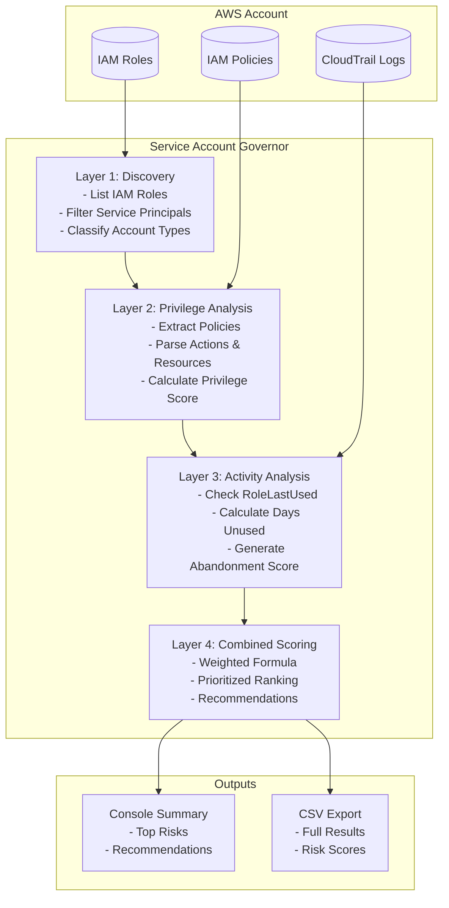

# Service Account Governor

**AWS Service Account Risk Scoring & Remediation Engine**

*Research Project by Nathaniel Dadson*
*Independent Security Research*

---

## Overview

### The Problem

Enterprise AWS environments accumulate thousands of service accounts, including:

* Lambda execution roles
* EC2 instance profiles
* Service-linked roles
* Application service accounts

Over time, organizations lose visibility into:

* Which service accounts are still required
* Which accounts have excessive permissions
* Which identities have become abandoned or unused

Stale and over-privileged service accounts are among the most common attack paths used in modern cloud breaches.

### The Solution

**Service Account Governor** automatically:

1. Discovers AWS service accounts
2. Analyzes privilege levels
3. Tracks usage patterns
4. Calculates abandonment risk
5. Produces prioritized risk scores
6. Generates actionable remediation recommendations

Security teams can use the results to significantly reduce cloud attack surface and improve IAM governance.

> This is an open-source research project created to demonstrate practical cloud security automation techniques and machine identity governance concepts.

---

# Architecture



---

# Prerequisites

| Requirement | Version   | Notes                 |
| ----------- | --------- | --------------------- |
| Python      | 3.9+      | Required              |
| AWS Account | Free Tier | Personal Sandbox Only |
| AWS CLI     | 2.x+      | Required              |
| Git         | Latest    | Required              |

---

# AWS Permissions Required

The tool operates in **read-only mode**.

```json
{
  "Version": "2012-10-17",
  "Statement": [
    {
      "Effect": "Allow",
      "Action": [
        "iam:ListRoles",
        "iam:GetRole",
        "iam:ListAttachedRolePolicies",
        "iam:GetPolicy",
        "iam:GetPolicyVersion",
        "iam:ListRolePolicies",
        "iam:GetRolePolicy"
      ],
      "Resource": "*"
    }
  ]
}
```

---

# Installation

## Clone Repository

```bash
git clone https://github.com/natedadson/service-account-governor.git

cd service-account-governor
```

## Create Virtual Environment

### Linux / macOS

```bash
python3 -m venv venv

source venv/bin/activate
```

### Windows

```powershell
python -m venv venv

venv\Scripts\activate
```

## Install Dependencies

```bash
pip install -r requirements.txt
```

## Configure AWS Credentials

```bash
aws configure --profile service-account-governor
```

---

# Usage

## Quick Start

```bash
python src/combined_scorer.py
```

---

# Example Output

```text
======================================================================
Service Account Governor - Complete Risk Analysis
======================================================================

📋 Step 1: Discovering service accounts...

📊 Found 2 total IAM roles

✓ AWSServiceRoleForSupport → support.amazonaws.com
✓ AWSServiceRoleForTrustedAdvisor → trustedadvisor.amazonaws.com

📊 Step 2: Scoring service accounts...

======================================================================
📈 RISK ANALYSIS SUMMARY
======================================================================

🔴 TOP RISKIEST SERVICE ACCOUNTS

1. AWSServiceRoleForTrustedAdvisor

   Final Score: 35.5 / 100 (MEDIUM)

   Privilege Score: 1 / 100
   Activity Score: 100 / 100

   Recommendation:
   Review immediately - may be unnecessary

💾 Results exported to risk_analysis_results.csv
```

---

# Run Individual Modules

## Service Account Discovery

```bash
python -c "from discovery.find_service_roles import ServiceRoleDiscovery; d = ServiceRoleDiscovery(); print(d.discover_all_service_accounts())"
```

## Privilege Risk Scoring

```bash
python -c "from risk_scoring.privilege_score import PrivilegeScorer; p = PrivilegeScorer(); print(p.calculate_privilege_score('AWSServiceRoleForSupport'))"
```

## Activity Risk Scoring

```bash
python -c "from risk_scoring.activity_score import ActivityScorer; a = ActivityScorer(); print(a.calculate_activity_score('AWSServiceRoleForSupport'))"
```

---

# Project Structure

```text
service-account-governor/
│
├── README.md
├── requirements.txt
├── .gitignore
│
├── src/
│   ├── discovery/
│   │   └── find_service_roles.py
│   │
│   ├── risk_scoring/
│   │   ├── privilege_score.py
│   │   └── activity_score.py
│   │
│   └── combined_scorer.py
│
├── tests/
├── outputs/
└── docs/
```

---

# Risk Scoring Methodology

## Privilege Score (0–100)

**Weight: 50%**

| Factor                 | Weight               | Description                     |
| ---------------------- | -------------------- | ------------------------------- |
| Wildcard Actions       | 40 pts               | `"Action": "*"`                 |
| High Privilege Actions | 10 pts each (max 30) | `iam:*`, `sts:AssumeRole`, etc. |
| Wildcard Resources     | 20 pts               | `"Resource": "*"`               |
| Policy Count           | Up to 10 pts         | More policies = more complexity |

---

## Activity Score (0–100)

**Weight: 35%**

| Days Since Last Use | Score | Risk      |
| ------------------- | ----- | --------- |
| 0–30                | 0     | Active    |
| 31–60               | 25    | Low Usage |
| 61–90               | 50    | Moderate  |
| 91–180              | 75    | High      |
| 180+                | 100   | Abandoned |
| Never Used          | 100   | Critical  |

---

## Final Risk Classification

| Score  | Risk Level | Recommended Action          |
| ------ | ---------- | --------------------------- |
| 70–100 | CRITICAL   | Immediate Review / Deletion |
| 50–69  | HIGH       | Review This Week            |
| 30–49  | MEDIUM     | Review Next Sprint          |
| 10–29  | LOW        | Monitor                     |
| 0–9    | MINIMAL    | No Action Needed            |

---

# Development Roadmap

| Phase                            | Status     | Deliverable                   |
| -------------------------------- | ---------- | ----------------------------- |
| Phase 1: Discovery               | ✅ Complete | Service Account Inventory     |
| Phase 2: Privilege Scoring       | ✅ Complete | Privilege Risk Analysis       |
| Phase 3: Activity Scoring        | ✅ Complete | Abandonment Detection         |
| Phase 4: Combined Scoring        | ✅ Complete | Unified Risk Ranking          |

---

# License

MIT License

See the LICENSE file for details.

---

# Disclaimer

This software is intended for:

* Research
* Educational use
* Security experimentation

Guidelines:

* Run only in personal AWS sandbox environments
* Never deploy directly into production
* Review recommendations before taking action
* The author is not responsible for unintended changes resulting from use of the software

The tool performs **read-only operations by design**.

---

# Author

**Nathaniel Dadson**

Independent Security Researcher

Research Areas:

* AI for Cloud Security
* Cloud Infrastructure Entitlement Management (CIEM)
* Cloud Detection & Response (CDR)
* Machine Identity Security

GitHub:

https://github.com/natedadson/service-account-governor

---

# Citation

If you use this project in research, academic work, presentations, or derivative projects, please cite:

```text
Dadson, Nathaniel.
Service Account Governor: AWS Service Account Risk Scoring &
Remediation Engine.
Independent Security Research, 2026.
```

---

## Last Updated

**June 2026**
